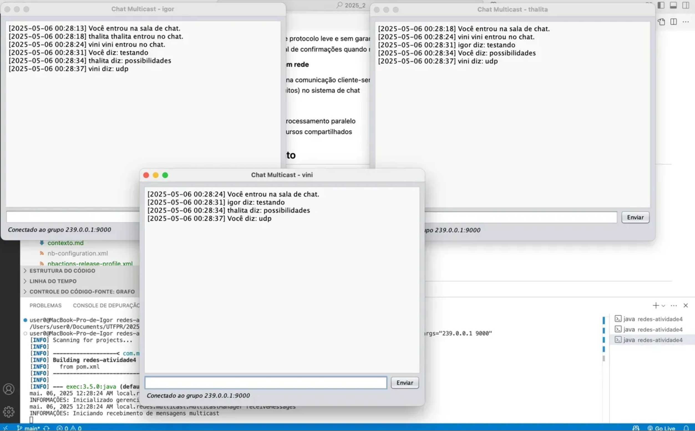

# Sistema de Comunicação UDP: Cliente-Servidor e Chat Multicast

Este projeto demonstra a implementação de uma aplicação cliente-servidor com funcionalidades duplas: comunicação UDP ponto-a-ponto e multicast, permitindo tanto envio de dados estruturados como chat entre múltiplos clientes.

## Características Principais

- 🔄 **Comunicação UDP ponto-a-ponto** para troca de objetos serializados
- 🔊 **Multicast UDP** para envio de mensagens de chat para grupos
- 🧵 **Processamento multithread** no servidor para alta concorrência
- 🛡️ **Tratamento robusto de exceções** e validação de dados
- 📊 **Sistema de logging** para monitoramento de operações
- 🌐 **Interfaces gráficas** para interação amigável com o usuário

## Requisitos

- Java JDK 8 ou superior
- Apache Maven 3.6.0 ou superior
- Rede que suporte comunicação multicast (para funcionalidades de chat)

## Arquitetura

```
src/main/java/local/redes/
├── modelo/         # Classes de domínio
│   └── Pessoa.java # Objeto serializável para troca de dados
├── rede/           # Camada de comunicação
│   ├── unicast/    # Comunicação ponto-a-ponto
│   └── multicast/  # Comunicação em grupo
├── ui/             # Interfaces com o usuário
└── util/           # Classes utilitárias
```

## Funcionalidades

### Sistema Cliente-Servidor (UDP Ponto-a-Ponto)
- Servidor multithread com pool gerenciado por ExecutorService
- Cliente com validação de entrada e feedback visual
- Transferência de objetos Pessoa serializados
- Confirmações de recebimento com timestamp

### Sistema de Chat (UDP Multicast)
- Criação e participação em salas de chat via grupos multicast
- Interface amigável para envio e recebimento de mensagens
- Identificação de usuários por nome
- Notificação de entrada e saída de participantes

## Como Executar

### Compilando o Projeto
```bash
cd /caminho/para/redes-atividade4
mvn clean compile
```

### Executando o Servidor
```bash
mvn exec:java -Dexec.mainClass="local.redes.Servidor"
```

### Executando o Cliente Padrão (Envio de Pessoa)
```bash
mvn exec:java -Dexec.mainClass="local.redes.Cliente"
```

### Executando o Cliente de Chat 
```bash
mvn exec:java -Dexec.mainClass="local.redes.multicast.ChatClient" -Dexec.args="224.0.0.1 9000"
```


## Demonstração Didática

Este projeto está sendo desenvolvido como ferramenta educacional para ilustrar conceitos importantes de redes de computadores:

1. **Protocolos orientados vs. não orientados à conexão**
   - UDP como exemplo de protocolo leve e sem garantias
   - Implementação manual de confirmações quando necessário

2. **Padrões de comunicação em rede**
   - Unicast (um para um) na comunicação cliente-servidor
   - Multicast (um para muitos) no sistema de chat

3. **Programação concorrente**
   - Uso de threads para processamento paralelo
   - Gerenciamento de recursos compartilhados

## Boas Práticas Implementadas

- **SOLID**: Princípios de design orientado a objetos
- **DRY**: Eliminação de código duplicado
- **Tratamento adequado de recursos**: Uso de try-with-resources
- **Validação defensiva**: Verificação de entradas e estados
- **Logging estruturado**: Para rastreamento e depuração
- **Documentação JavaDoc**: Em todas as classes e métodos públicos

## Limitações Conhecidas

- O protocolo UDP não garante entrega de pacotes
- A comunicação multicast pode não funcionar em algumas redes corporativas
- Tamanho máximo de pacotes UDP (geralmente 65.507 bytes)

## Próximos Passos

- [ ] Implementação de testes unitários abrangentes
- [ ] Adição de criptografia para comunicações sensíveis
